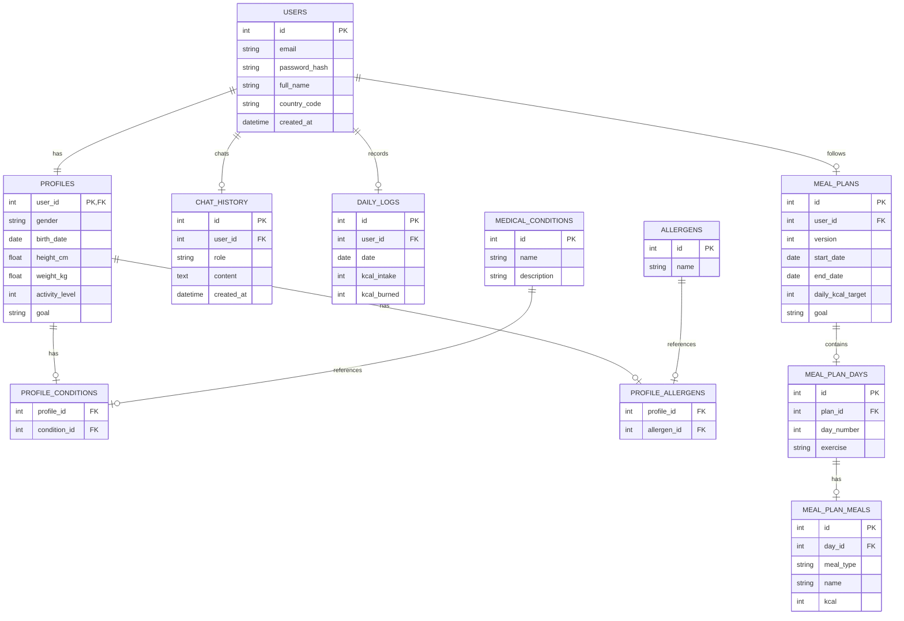

# TÀI LIỆU YÊU CẦU NGHIỆP VỤ (BUSINESS REQUIREMENTS DOCUMENT - BRD)
## DỰ ÁN: NUTRISMART AGENT — TRỢ LÝ DINH DƯỠNG CÁ NHÂN HÓA THÔNG MINH
**Đơn vị thực hiện:** Nhóm E15

---

## 1. GIỚI THIỆU DỰ ÁN (PROJECT OVERVIEW)
Dự án **NutriSmart Agent** là một nền tảng hỗ trợ sức khỏe và dinh dưỡng cá nhân hóa. Bằng cách kết hợp giữa các thuật toán tính toán dinh dưỡng lâm sàng, trí tuệ nhân tạo nhận diện hình ảnh (AI Vision) và các mô hình ngôn ngữ lớn (LLM - Chatbot tư vấn), hệ thống giúp người dùng dễ dàng theo dõi lượng calo, lên thực đơn ăn uống và luyện tập phù hợp với thể trạng cá nhân cũng như các chỉ định y tế đặc thù (bệnh nền, dị ứng).

---

## 2. ĐỐI TƯỢNG SỬ DỤNG (TARGET USERS)
* **Người dùng phổ thông:** Muốn theo dõi chỉ số cơ thể (BMI), kiểm soát lượng calo nạp/tiêu hao hàng ngày để giảm cân, tăng cơ hoặc duy trì cân nặng ổn định.
* **Người dùng có bệnh lý/bệnh nền (Medical Patients):** Những người có bệnh lý mãn tính như Đái tháo đường típ 2, Tăng huyết áp, Rối loạn lipid máu cần tuân thủ nghiêm ngặt chế độ ăn hạn chế (đường, muối, chất béo bão hòa...).
* **Người dùng bị dị ứng thực phẩm (Allergic Users):** Những người mẫn cảm với một số nhóm thực phẩm phổ biến (đậu phộng, hải sản, sữa, gluten...).

---

## 3. YÊU CẦU NGHIỆP VỤ & CHỨC NĂNG CHI TIẾT (FUNCTIONAL REQUIREMENTS)

### 3.1. Đăng ký & Thiết lập Hồ sơ Sức khỏe Cá nhân (User Profile & Health Registration)
* **Thông tin tài khoản:** Họ tên, email, mật khẩu và **quốc gia cư trú** (Dùng để lọc các loại thuốc, hoạt chất hoặc tiêu chuẩn dinh dưỡng bị cấm/áp dụng theo quy định của nước sở tại).
* **Chỉ số sinh trắc:**
  * Giới tính sinh học (Nam/Nữ/Khác).
  * Ngày sinh (tính tuổi thực tế).
  * Chiều cao (cm), Cân nặng (kg).
* **Mức độ vận động hàng ngày:** Gồm 5 cấp độ (từ ít vận động đến vận động cường độ cao của vận động viên).
* **Mục tiêu sức khỏe:** Giảm cân (Lose weight), Tăng cơ (Gain muscle), Duy trì cân nặng (Maintain), hoặc Theo chỉ định y tế (Medical).
* **Khai báo lâm sàng:**
  * Bệnh nền hiện tại: Đái tháo đường típ 2, Tăng huyết áp, Rối loạn lipid máu...
  * Các chất gây dị ứng thực phẩm: Đậu phộng, hải sản, sữa bò, gluten...
* **Hành vi hệ thống:** Tự động tính toán chỉ số BMI dự kiến và lưu trữ hồ sơ chi tiết để làm đầu vào cho các thuật toán cá nhân hóa tiếp theo.

### 3.2. Lộ trình Ăn uống & Tập luyện Cá nhân hóa (Personalized Nutrition & Exercise Plan)
* **Tính toán chỉ số năng lượng:** Dựa trên các chỉ số sinh trắc học và mức độ vận động (áp dụng công thức Harris-Benedict hoặc Mifflin-St Jeor), hệ thống tự động xác định lượng Calo mục tiêu hàng ngày (`daily_kcal_target`).
* **Sinh lộ trình tự động:**
  * Tạo thực đơn chi tiết theo từng ngày (gồm Bữa sáng, Bữa trưa, Bữa tối, Bữa phụ) ghi rõ tên món ăn và lượng calo tương ứng.
  * Đề xuất bài tập luyện tập thể chất (`exercise`) kèm theo mỗi ngày để thúc đẩy mục tiêu cân nặng.
* **Ràng buộc nghiệp vụ:** Thực đơn được thiết kế phải loại bỏ hoàn toàn các nguyên liệu gây dị ứng đã khai báo và hạn chế tối đa các thực phẩm gây hại cho bệnh nền của người dùng.

### 3.3. Phân tích Món ăn qua Hình ảnh (AI Vision Meal Analysis)
* **Đầu vào:** Hình ảnh món ăn chụp trực tiếp từ camera hoặc tải lên từ thư viện máy.
* **Xử lý AI (Vision Service):**
  * Nhận diện tên món ăn chính xác nhất (`food_name`).
  * Trả về độ tin cậy của dự đoán (`confidence`).
  * Ước tính lượng Calo (`estimated_kcal`) và hàm lượng dinh dưỡng đa lượng (Protein, Fat, Carbs nếu có).
* **Kiểm tra độ phù hợp sức khỏe (Suitability Check - Nghiệp vụ cốt lõi):**
  * Đối chiếu món ăn được nhận diện với hồ sơ bệnh nền và dị ứng thực phẩm của người dùng.
  * Đưa ra cảnh báo (`suitability_note`) rõ ràng nếu món ăn chứa tác nhân gây dị ứng hoặc không tốt cho bệnh nền của họ (Ví dụ: *"Cảnh báo: Món ăn này có chỉ số GI cao, không phù hợp cho người bị Đái tháo đường"*).

### 3.4. Trợ lý Tư vấn Dinh dưỡng AI (AI Nutritionist Chat Agent)
* **Giao diện:** Khung chat thời gian thực thân thiện.
* **Cơ chế hoạt động:**
  * Trợ lý ảo sử dụng mô hình ngôn ngữ lớn (LLM chạy nội bộ qua Ollama hoặc kết nối API Cloud).
  * Trợ lý AI có quyền truy cập vào thông tin hồ sơ sức khỏe hiện tại (bệnh nền, dị ứng, mục tiêu) và nhật ký dinh dưỡng của người dùng.
  * Cung cấp lời khuyên dinh dưỡng, gợi ý công thức nấu ăn, trả lời thắc mắc y khoa thường thức một cách cá nhân hóa sâu sắc thay vì chỉ đưa ra câu trả lời chung chung.

### 3.5. Nhật ký Theo dõi & Biểu đồ Tiến trình (Nutrition Tracking & Dashboard)
* **Theo dõi hàng ngày:**
  * Thống kê lượng calo nạp vào (`kcal_intake`) và tiêu hao (`kcal_burned`) trong ngày.
  * Tính toán lượng Calo còn lại được phép ăn (`Remaining = Calo mục tiêu - Calo đã nạp + Calo tiêu hao`).
* **Báo cáo trực quan:**
  * Vẽ biểu đồ xu hướng Calo nạp vào vs. Calo tiêu hao trong 7 ngày gần nhất dưới dạng biểu đồ đường (Line Chart).
  * Giúp người dùng có cái nhìn tổng quan về mức độ kỷ luật và tiến trình thực hiện mục tiêu.

---

## 4. YÊU CẦU PHI CHỨC NĂNG (NON-FUNCTIONAL REQUIREMENTS)
* **Tính bảo mật (Security):** Hồ sơ y tế, bệnh nền và chỉ số cơ thể là dữ liệu cá nhân nhạy cảm, cần được bảo mật và truyền tải an toàn bằng cơ chế mã hóa và phân quyền qua Token (JWT).
* **Độ trễ thấp (Performance):** AI Vision phân tích ảnh món ăn cần trả kết quả trong vòng dưới 3 giây. Chatbot phản hồi dưới dạng streaming hoặc phản hồi nhanh chóng để tối ưu trải nghiệm người dùng.
* **Tính khả dụng (Usability):** Giao diện thiết kế theo phong cách hiện đại, trực quan, hỗ trợ hiển thị tốt trên cả máy tính và điện thoại thông minh (Responsive layout). Sử dụng tone màu xanh lá/emerald tạo cảm giác khỏe mạnh, an toàn và thân thiện.

---

## 5. THIẾT KẾ CƠ SỞ DỮ LIỆU ĐỀ XUẤT (PROPOSED DATABASE SCHEMA)

Hệ thống cần lưu trữ các thực thể thông tin sau để vận hành đầy đủ các luồng nghiệp vụ trên:

