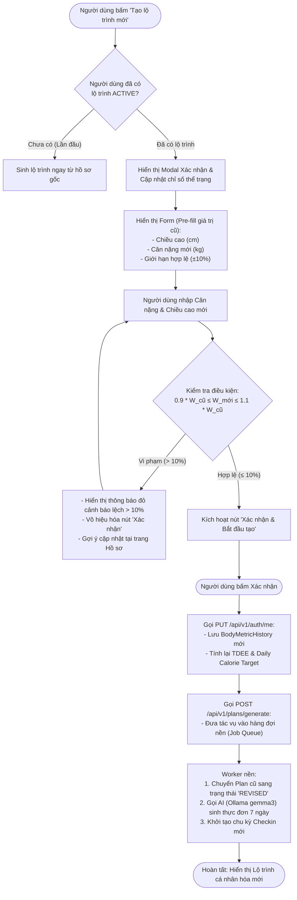
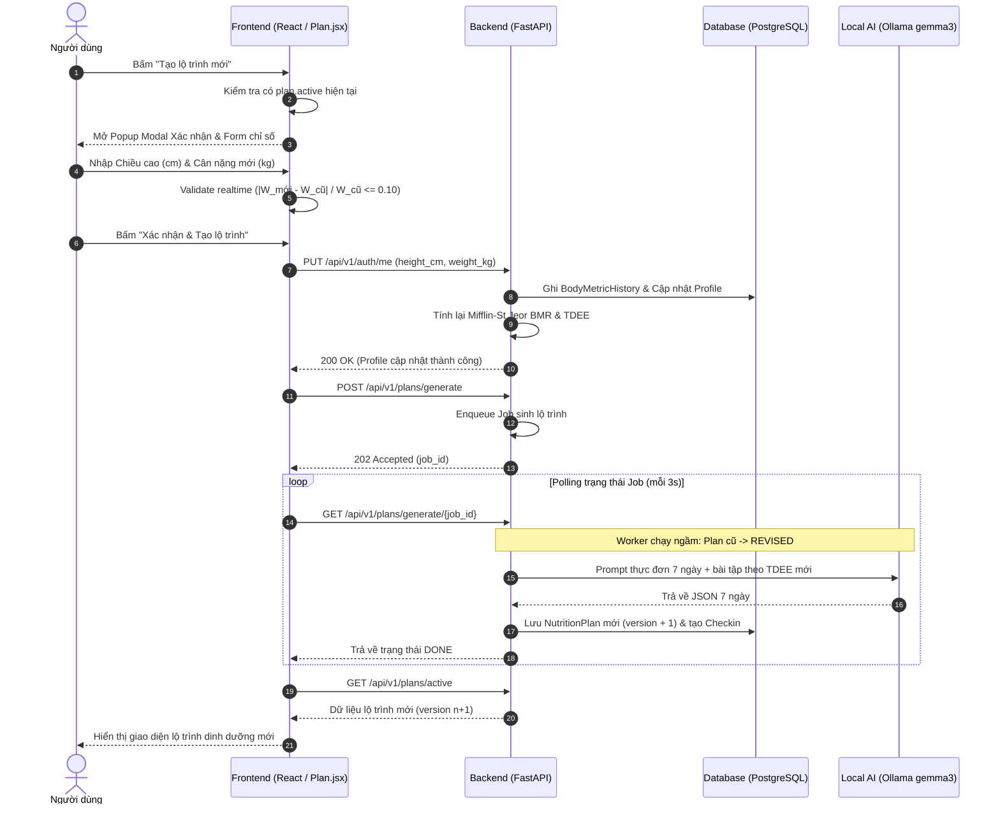

# TÀI LIỆU THIẾT KẾ KIẾN TRÚC & LUỒNG XỬ LÝ
## TÍNH NĂNG: XÁC NHẬN & CẬP NHẬT CHỈ SỐ KHI TẠO LỘ TRÌNH MỚI (PLAN RECREATION FLOW)
**Dự án:** NutriSmart Agent
**Tác giả:** Nhóm E15
**Ngày cập nhật:** 20/08/2026

---

## 1. Mục tiêu & Ý nghĩa thiết kế

1. **Bảo vệ dữ liệu người dùng (Data Loss Prevention):**
   - Ngăn ngừa tình trạng người dùng vô tình bấm nút *"Tạo lộ trình mới"* làm gián đoạn hoặc ghi đè lộ trình 7 ngày đang thực hiện.
2. **Hiệu chuẩn thể trạng động (Dynamic Profile Calibration):**
   - Lộ trình dinh dưỡng được tối ưu hóa dựa trên chỉ số thể trạng thực tế. Khi bắt đầu chu kỳ mới, việc cập nhật lại **Cân nặng** và **Chiều cao** giúp thuật toán tính lại chính xác BMR (Mifflin-St Jeor), TDEE và Calorie Target.
3. **Rào chắn an toàn y tế (10% Weight Delta Guardrail):**
   - Biến động cân nặng quá $10\%$ trong một chu kỳ ngắn thường do lỗi gõ nhầm (typo) hoặc sụt/tăng cân bệnh lý bất thường. Việc giới hạn và cảnh báo giúp bảo vệ người dùng và đảm bảo tính an toàn của hệ thống.

---

## 2. Sơ đồ Luồng Hoạt Động (Activity Flowchart)

---

## 3. Sơ đồ Tuần tự Hệ thống (Sequence Diagram)

---

## 4. Đặc tả Công thức & Ràng buộc Kiểm tra (Validation Rules)

### 4.1. Quy tắc giới hạn cân nặng $\pm 10\%$
Gọi $W_{cũ}$ là cân nặng ghi nhận gần nhất, $W_{mới}$ là cân nặng người dùng vừa nhập:

$$\Delta W = |W_{mới} - W_{cũ}|$$

Điều kiện hợp lệ:
$$\frac{\Delta W}{W_{cũ}} \le 0.10 \iff 0.90 \times W_{cũ} \le W_{mới} \le 1.10 \times W_{cũ}$$

*Ví dụ minh họa:*
- Cân nặng gần nhất $W_{cũ} = 70.0\text{ kg}$.
- Khoảng cho phép: $[70 \times 0.9, 70 \times 1.1] = [63.0\text{ kg}, 77.0\text{ kg}]$.
- Nếu nhập $60.0\text{ kg}$ (giảm $14.3\%$) $\rightarrow$ **Cảnh báo lỗi, khóa nút gửi.**

---

### 4.2. Công thức tính lại Năng lượng tiêu chuẩn (Mifflin-St Jeor)

1. **Chỉ số trao đổi chất cơ bản (BMR):**
   $$\text{BMR} = 10 \times W_{mới} + 6.25 \times H_{mới} - 5 \times \text{Tuổi} + S$$
   *Trong đó:* $S = +5$ (Nam) hoặc $S = -161$ (Nữ).

2. **Tổng năng lượng tiêu hao hàng ngày (TDEE):**
   $$\text{TDEE} = \text{BMR} \times \text{Activity\_Multiplier}$$

3. **Lượng Calo mục tiêu (Target Kcal):**
   - Giảm cân (`LOSE_WEIGHT`): $\text{Target} = \text{TDEE} - 500\text{ kcal}$
   - Tăng cơ (`GAIN_MUSCLE`): $\text{Target} = \text{TDEE} + 300\text{ kcal}$
   - Giữ cân (`MAINTAIN`): $\text{Target} = \text{TDEE}$

---

## 5. Đặc tả Giao diện Modal (UI Specification)

### Các thành phần chính trong Modal:
1. **Tiêu đề:** *"Xác nhận tạo lộ trình dinh dưỡng mới"*
2. **Cảnh báo tiến trình:** *"Lộ trình hiện tại sẽ được lưu trữ. Hệ thống sẽ tối ưu hóa lộ trình 7 ngày tiếp theo dựa trên thể trạng mới nhất của bạn."*
3. **Trường nhập liệu:**
   - **Chiều cao (cm):** Input dạng số nguyên/thập phân (min: 50, max: 250).
   - **Cân nặng hiện tại (kg):** Input số (min: 20, max: 300, bước nhảy 0.1).
   - **Gợi ý khoảng an toàn:** Hiển thị nhãn nhỏ màu xám dưới ô cân nặng: `(Khoảng hợp lệ: 63.0 kg - 77.0 kg)`.
4. **Trạng thái cảnh báo vi phạm:**
   - Text lỗi màu đỏ cam khi nhập ngoài khoảng 10%:
     *"Cân nặng thay đổi hơn 10% so với lần ghi nhận gần nhất (70.0 kg). Nếu có sự thay đổi lớn, vui lòng cập nhật tại trang Hồ sơ."*
5. **Nút thao tác:**
   - **Hủy bỏ (Cancel):** Đóng modal, giữ nguyên màn hình cũ.
   - **Xác nhận & Tạo lộ trình (Confirm):** Nút chính (primary), chỉ bật khi input hợp lệ.
