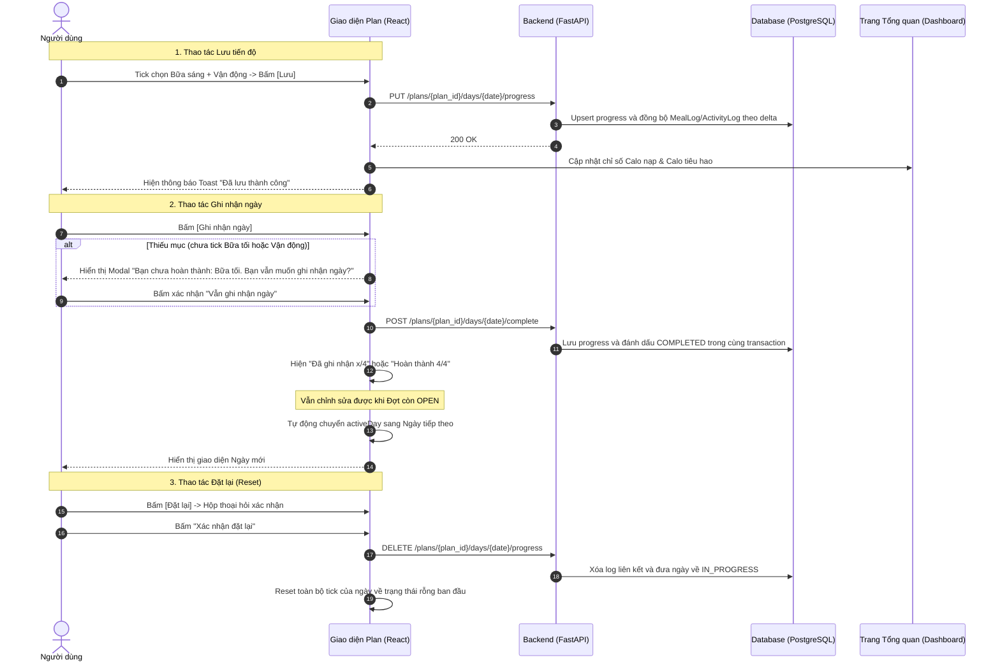

# ĐẶC TẢ & SƠ ĐỒ CƠ CHẾ HOẠT ĐỘNG BỘ 3 NÚT THAO TÁC LỘ TRÌNH
## [LƯU - GHI NHẬN - ĐẶT LẠI] (INTERACTIVE PLAN ACTION BUTTONS)
**Dự án:** NutriSmart Agent
**Trang áp dụng:** Lộ trình dinh dưỡng & luyện tập cá nhân hóa (`frontend/src/pages/Plan.jsx`)
**Ngày cập nhật:** 20/08/2026

---

## 1. Sơ đồ Luồng Nghiệp vụ (Activity Flowchart)

```mermaid
flowchart TD
    H{"Ngày có được cập nhật?"} -->|Ngày tương lai| I["Chỉ xem trước"]
    H -->|Đợt đã đóng| J["Read-only"]
    H -->|Hôm nay hoặc ngày cũ trong Đợt OPEN| A["User tick các mục: Sáng, Trưa, Tối, Vận động"]
    A --> B{"Người dùng chọn thao tác nào?"}

    %% Nhánh 1: Bấm [Lưu]
    B -->|1. Bấm [Lưu]| C["- Lưu trạng thái tick<br/>- Đồng bộ món ăn đã tick vào Nhật ký (MealLog)<br/>- Đồng bộ bài tập vào ActivityLog<br/>- Tab Tổng quan (Dashboard) cập nhật ngay Calo & Thâm hụt"]

    %% Nhánh 2: Bấm [Ghi nhận ngày]
    B -->|2. Bấm [Ghi nhận ngày]| D{"Đã tick đủ 4 mục chưa?"}
    D -->|Chưa đủ| E["Hiện Modal cảnh báo:<br/>'Bạn chưa hoàn thành: Bữa tối, Vận động. Bạn vẫn muốn ghi nhận ngày 1 không?'"]
    E -->|Xác nhận ghi nhận| F["1. Đánh dấu ngày đã ghi nhận<br/>2. Hiện Đã ghi nhận x/4 hoặc Hoàn thành 4/4<br/>3. Cho phép sửa tới khi Đợt đóng"]
    D -->|Đã đủ 4/4| F

    %% Nhánh 3: Bấm [Đặt lại]
    B -->|3. Bấm [Đặt lại]| G["- Bỏ tick toàn bộ các mục trong ngày<br/>- Hoàn tác/xóa dữ liệu đã sync của ngày đó<br/>- Trả ngày về IN_PROGRESS"]
```

---

## 2. Sơ đồ Tuần tự Hệ thống (Sequence Diagram)



---

## 3. Bảng Đặc tả Chức năng & Trạng thái UI của 3 Nút

| Nút Thao tác | Màu sắc / Style | Điều kiện kích hoạt | Hành vi khi bấm (Behavior) | Kết quả hiển thị (Feedback UI) |
| :--- | :--- | :--- | :--- | :--- |
| **💾 Lưu** | Accent / Xanh dương nhẹ (`bg-accent-soft text-accent-strong`) | Ngày hiện tại hoặc ngày cũ thuộc Đợt đang `OPEN` | - Lưu trạng thái tick vào DB<br/>- Đồng bộ món ăn sang `MealLog`<br/>- Đồng bộ vận động sang `ActivityLog` | - Toast: *"Đã lưu tiến độ"*<br/>- Dashboard cập nhật Calo khi tải lại |
| **🏁 Ghi nhận ngày** | Primary / Xanh lá nổi bật (`bg-accent-strong`) | Ngày hiện tại hoặc ngày cũ thuộc Đợt đang `OPEN` | - Kiểm tra đủ item<br/>- Nếu thiếu: mở Modal cảnh báo<br/>- Lưu progress và chuyển status sang `COMPLETED`<br/>- Vẫn cho sửa tới khi Đợt đóng | - Đủ item: `Hoàn thành 4/4`<br/>- Thiếu item: `Đã ghi nhận x/4`<br/>- Chuyển sang ngày tiếp theo có thể thao tác |
| **🔄 Đặt lại** | Ghost / Xám viền mờ (`text-muted hover:text-danger`) | Đợt đang `OPEN` và ngày không ở tương lai | - Mở confirm dialog xác nhận<br/>- Xóa sạch tick của ngày đó<br/>- Hoàn tác đồng bộ<br/>- Đưa status về `IN_PROGRESS` | - Checkbox ngày đó trở về rỗng<br/>- Toast: *"Đã đặt lại ngày X"* |
